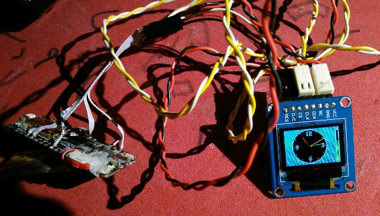
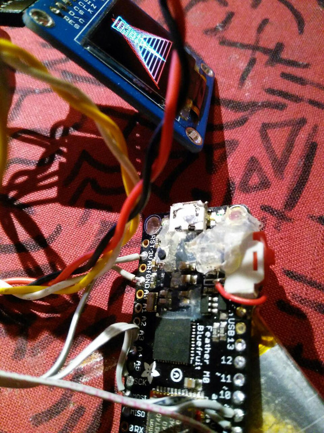

This is a library for the 0.96" 16-bit Color OLED with SSD1331 driver chip

Pick one up today in the adafruit shop! http://www.adafruit.com/products/684

These displays use SPI to communicate, 4 or 5 pins are required to  
interface

Adafruit invests time and resources providing this open source code, 
please support Adafruit and open-source hardware by purchasing 
products from Adafruit!

Written by Limor Fried/Ladyada  for Adafruit Industries.  
BSD license, check license.txt for more information
All text above must be included in any redistribution

# Modification for SSD1331 (SPI) and Coretex M0

I did a evil hack to run the popular SSD1331 RGB oLED Display on
hardware SPI with a feather M0. I compare the Adafruit SSD1306 Lib (monochrom)
with the Adafruit SSD1331 Lib and modified it a bit.

Some strange I2C and spark stuff is removed. Sorry.

Boards:

 -  Feather M0
 -  Arduino Zero

I hope, that Adafruit merge that Idea/code and make it better (using a wrapper design pattern, maybe?). 

# Wireing SPI

 -  Data (or DIN) to MOSI
 -  SCK/Clk (or Clock) to SCK
 -  RES (or Reset) to D6
 -  DC (or D/C or Data-Command) to D5
 -  CS (or chip select or ID) to 12
 -  VCC to 3V
 -  GND to GND

# Examples

 -  the normal test example
 -  a clock and powerbar example

# Action picture

Yes. It works! I am so happy about that. But it is a ugly version.

